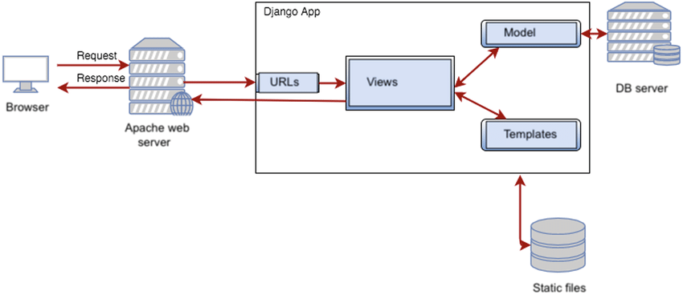
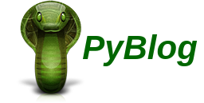
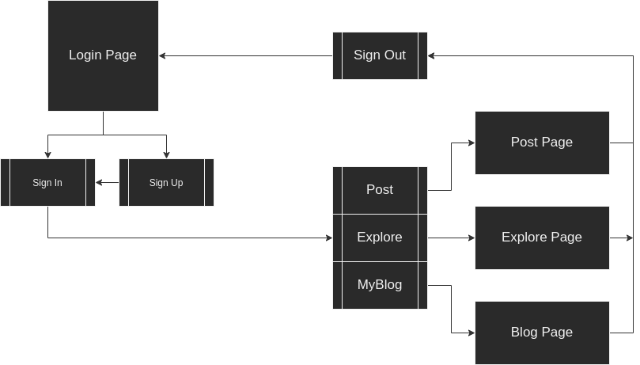

# PyBlog


Esse projeto tem como objetivo o desenvolvimento de um website de blogs. Fizemos esse site de blogs inspirado no seguinte projeto de clone de instagram: [[https://github.com/byronlara5/django_instagram_clone_youtube](https://github.com/byronlara5/django_instagram_clone_youtube)]

**Para um melhor entendimento de como o framework django funciona:**




**Planejamento da arquitetura:**





---

## Como Rodar

1. Crie um ambiente e o ative
2. Instale os prerrequisitos
3. Rode o servidor

### Crie um ambiente e o ative

```bash
python -m venv pyblog_en
```

No Linux (via bash)

```bash
source pyblog_env/bin/activate

```

No Windows (via powershell)

```
.\pyblog_env\Scripts\Activate.ps1

```

### Instale os prerrequisitos

```bash
pip install -r requirements.txt

```

### Rode o servidor

```bash
python manage.py runserver

```

## Built With

- [Bulma](https://bulma.io/) - Bulma is a free, open source CSS framework based on Flexbox
- [Django](https://www.djangoproject.com/) - Web framework